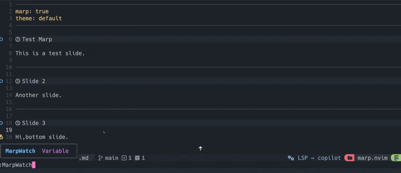

# marp.nvim

A Neovim plugin for creating, previewing, and exporting
[Marp](https://marp.app/) slide decks.

[日本語](#日本語)



## Highlights

- Live preview with Marp CLI watch mode
- Server mode that opens the current deck from Marp's HTTP server
- One-time HTML preview without leaving a watcher behind
- Export to HTML, PDF, PPTX, PNG, JPEG, and speaker-note text
- First-slide thumbnail generation
- Marp CLI v4 config discovery, including `marp.config.ts` and
  `package.json#marp`
- Browser, PDF outline, editable PPTX, image, and Bespoke template options
- Native `:checkhealth marp` diagnostics
- Safe argv-based process execution through `vim.system()`

marp.nvim is tested with **Marp CLI v4.5.0**. The v4.5 release added ESM/import
support to the standalone binary, improved CLI startup time, and fixed Firefox
and macOS rendering issues. See the
[official v4.5.0 release notes](https://github.com/marp-team/marp-cli/releases/tag/v4.5.0).

## Requirements

- Neovim 0.10 or newer
- [Marp CLI](https://github.com/marp-team/marp-cli) v4
- A supported browser for PDF, PPTX, PNG, and JPEG conversion
- Node.js 18 or newer only when using the npm-distributed CLI

Run `:checkhealth marp` after installation.

## Installation

### lazy.nvim

```lua
{
  "nwiizo/marp.nvim",
  config = function()
    require("marp").setup({
      -- Optional overrides
    })
  end,
}
```

The plugin registers lightweight commands at startup and loads its main module
only when a command is used, so extra command-level lazy-loading is unnecessary.

To use the latest CLI through `npx`, prefer an argv list:

```lua
require("marp").setup({
  marp_command = { "npx", "@marp-team/marp-cli@latest" },
})
```

A string such as `"npx @marp-team/marp-cli@latest"` remains supported for
backward compatibility. Use a list when an executable path or argument contains
spaces.

### packer.nvim

```lua
use({
  "nwiizo/marp.nvim",
  config = function()
    require("marp").setup({})
  end,
})
```

## Commands

| Command | Description |
| --- | --- |
| `:MarpWatch` | Start live preview for the current Markdown deck |
| `:MarpStop` | Stop the process for the current buffer |
| `:MarpStopAll` | Stop all Marp processes |
| `:MarpPreview` | Generate HTML once, open it, and exit |
| `:MarpList` | List active watch/server processes |
| `:MarpExport [format] [output]` | Export the deck; default format is `html` |
| `:MarpThumbnail [png\|jpeg]` | Export only the first slide |
| `:MarpTheme {theme}` | Set `default`, `gaia`, or `uncover` |
| `:MarpSnippet {name}` | Insert a Marp snippet |
| `:MarpInfo` | Show deck, theme, slide, process, and export information |
| `:MarpCopyPath` | Copy the generated HTML path |
| `:MarpConfig` | Open the Marp CLI config detected for the current deck |
| `:MarpDebug` | Run an in-editor CLI diagnostic |
| `:checkhealth marp` | Check Neovim, Marp CLI, stdin safety, and config |

Export examples:

```vim
:MarpExport
:MarpExport pdf
:MarpExport pptx build/talk.pptx
:MarpThumbnail jpeg
```

Formats are `html`, `pdf`, `pptx`, `png`, `jpeg`, and `notes`.
PNG/JPEG deck exports create numbered files such as `talk.001.png`; marp.nvim
reports and copies the paths that Marp actually created.

## Configuration

```lua
require("marp").setup({
  -- Executable and project config
  marp_command = "marp", -- string or argv list
  config_file = nil, -- path; false disables Marp config discovery
  node_options = "",

  -- Preview process
  server_mode = false, -- false: --watch, true: --server
  html_option = true,
  no_stdin = true, -- keep enabled for Neovim jobs

  -- Security: opt in only for trusted decks that need local assets
  allow_local_files = false,

  -- App used to open generated URLs; string or argv list, nil uses vim.ui.open()
  browser = nil,

  -- Browser used internally by Marp for PDF/PPTX/image conversion
  browser_kind = nil, -- "auto", "chrome", "edge", "firefox", or a list
  browser_path = nil,
  browser_protocol = nil, -- "cdp" or "webdriver-bidi"
  browser_timeout = nil, -- seconds; 0 disables the timeout

  -- HTML template
  template = nil, -- "bare" or "bespoke"
  bespoke_osc = nil,
  bespoke_progress = nil,
  bespoke_transition = nil,

  -- PDF/PPTX
  pdf_notes = false,
  pdf_outlines = false,
  pdf_outlines_pages = nil,
  pdf_outlines_headings = nil,
  pptx_editable = false,

  -- Images and themes
  image_scale = 1,
  jpeg_quality = 85,
  theme_set = {},
  themes = {
    default = "default",
    gaia = "gaia",
    uncover = "uncover",
  },

  -- Notifications
  auto_copy_path = true,
  show_file_size = true,
  suggest_gitignore = true,
  debug = false,
})
```

`browser` opens the generated URL on the desktop; use an argv list when the
opener needs arguments. `browser_kind` selects the browser engine Marp CLI uses
for conversion; the two options are intentionally separate.

### Marp CLI config discovery

marp.nvim searches upward from the current deck using the same locations as
Marp CLI's `cosmiconfig` integration:

- `package.json` with a top-level `marp` property
- `.marprc*`
- `.config/marprc*`
- `marp.config.js`, `.ts`, `.cjs`, or `.mjs`

The detected directory becomes the subprocess working directory. Set
`config_file` to a path to force a config, or to `false` to pass
`--no-config-file`.

### Why `--no-stdin` is enabled

Marp CLI exposes a hidden stdin input enabled by default. A Neovim process may
provide a non-TTY stdin pipe, causing Marp to wait even when a Markdown path was
passed. marp.nvim therefore adds `--no-stdin` to every file-based invocation.
Set `no_stdin = false` only for a custom wrapper that does not accept this flag.
This covers the hang reported in
[PR #2](https://github.com/nwiizo/marp.nvim/pull/2) and
[Issue #3](https://github.com/nwiizo/marp.nvim/issues/3).

## Usage

1. Open a Marp Markdown deck.
2. Run `:MarpWatch`.
3. Save the file to refresh the browser.
4. Run `:MarpStop`, or close the buffer.

Set `server_mode = true` to serve the deck directory over HTTP instead of
writing watched HTML to disk.

## Troubleshooting

1. Run `:checkhealth marp`.
2. Run `:MarpDebug` from a Markdown buffer.
3. Enable `debug = true` to include CLI stdout/stderr in notifications.
4. Check active processes with `:MarpList`, then use `:MarpStopAll`.

If local images do not render during PDF/PPTX/image conversion, enable
`allow_local_files` only for decks you trust.

---

# 日本語

[Marp](https://marp.app/) のスライドを Neovim からプレビュー・変換する
プラグインです。

## 主な機能

- Marp CLI watch mode によるライブプレビュー
- 現在の deck のディレクトリを配信する server mode
- watcher を残さない1回限りの HTML プレビュー
- HTML / PDF / PPTX / PNG / JPEG / speaker notes への出力
- 先頭スライドのサムネイル生成
- `marp.config.ts` や `package.json#marp` を含む Marp CLI v4 設定探索
- browser、PDF outline、editable PPTX、画像、Bespoke template の設定
- `:checkhealth marp` による標準的な診断
- `vim.system()` と argv 配列による安全な process 実行

marp.nvim は **Marp CLI v4.5.0** で動作確認しています。v4.5 では
standalone binary の ESM/import 対応、起動高速化、Firefox/macOS の描画修正が
入りました。詳細は
[公式リリースノート](https://github.com/marp-team/marp-cli/releases/tag/v4.5.0)
を参照してください。

## 必要環境

- Neovim 0.10 以上
- [Marp CLI](https://github.com/marp-team/marp-cli) v4
- PDF / PPTX / PNG / JPEG 変換時は対応 browser
- npm 版 CLI を使う場合のみ Node.js 18 以上

インストール後に `:checkhealth marp` を実行してください。

## インストール

### lazy.nvim

```lua
{
  "nwiizo/marp.nvim",
  config = function()
    require("marp").setup({
      -- 必要な設定だけ上書き
    })
  end,
}
```

command 定義だけを起動時に読み、main module は command 実行時まで遅延されます。

最新 CLI を `npx` で使う場合は argv 配列を推奨します。

```lua
require("marp").setup({
  marp_command = { "npx", "@marp-team/marp-cli@latest" },
})
```

従来の文字列 `"npx @marp-team/marp-cli@latest"` も利用できます。空白を含む
実行ファイルパスや引数には配列を使ってください。

## コマンド

| コマンド | 説明 |
| --- | --- |
| `:MarpWatch` | 現在の deck のライブプレビューを開始 |
| `:MarpStop` | 現在の buffer の process を停止 |
| `:MarpStopAll` | すべての Marp process を停止 |
| `:MarpPreview` | HTML を1回生成して開き、process を終了 |
| `:MarpList` | 動作中の watch/server process を表示 |
| `:MarpExport [形式] [出力先]` | deck を出力。既定は `html` |
| `:MarpThumbnail [png\|jpeg]` | 先頭スライドだけを画像化 |
| `:MarpTheme {theme}` | `default` / `gaia` / `uncover` を設定 |
| `:MarpSnippet {name}` | Marp snippet を挿入 |
| `:MarpInfo` | deck・theme・slide・process・export 情報を表示 |
| `:MarpCopyPath` | 生成した HTML path を clipboard へコピー |
| `:MarpConfig` | 現在の deck で検出した Marp CLI config を開く |
| `:MarpDebug` | editor 内で CLI 診断を実行 |
| `:checkhealth marp` | Neovim、Marp CLI、stdin、config を診断 |

```vim
:MarpExport
:MarpExport pdf
:MarpExport pptx build/talk.pptx
:MarpThumbnail jpeg
```

利用できる形式は `html`、`pdf`、`pptx`、`png`、`jpeg`、`notes` です。
PNG/JPEG の deck 出力は `talk.001.png` のような連番 file になり、実際に
生成された全 path を通知・copy します。

## 設定

```lua
require("marp").setup({
  marp_command = "marp", -- 文字列または argv 配列
  config_file = nil, -- path。false で config 探索を無効化
  node_options = "",

  server_mode = false, -- false: --watch、true: --server
  html_option = true,
  no_stdin = true,
  allow_local_files = false, -- 信頼できる deck でのみ有効化

  browser = nil, -- URL を開く app。文字列/argv 配列、nil は vim.ui.open()
  browser_kind = nil, -- Marp 変換用 browser
  browser_path = nil,
  browser_protocol = nil, -- "cdp" または "webdriver-bidi"
  browser_timeout = nil,

  template = nil, -- "bare" または "bespoke"
  bespoke_osc = nil,
  bespoke_progress = nil,
  bespoke_transition = nil,

  pdf_notes = false,
  pdf_outlines = false,
  pdf_outlines_pages = nil,
  pdf_outlines_headings = nil,
  pptx_editable = false,

  image_scale = 1,
  jpeg_quality = 85,
  theme_set = {},
  themes = {
    default = "default",
    gaia = "gaia",
    uncover = "uncover",
  },

  auto_copy_path = true,
  show_file_size = true,
  suggest_gitignore = true,
  debug = false,
})
```

`browser` は生成 URL を desktop で開く設定です。引数付きなら argv 配列を
指定します。`browser_kind` は Marp CLI が PDF/PPTX/画像変換に使う engine の
設定です。

### Marp CLI config の探索

現在の deck から上方向へ、Marp CLI と同じ場所を探索します。

- top-level に `marp` を持つ `package.json`
- `.marprc*`
- `.config/marprc*`
- `marp.config.js` / `.ts` / `.cjs` / `.mjs`

検出したディレクトリを subprocess の working directory にします。
`config_file` に path を指定すると固定でき、`false` では
`--no-config-file` を渡します。

### `--no-stdin` を既定で付ける理由

Marp CLI の hidden stdin input は既定で有効です。Neovim の process が
非TTYの stdin pipe を渡すと、Markdown path があっても EOF 待ちになる場合が
あります。そのため、すべての file-based command に `--no-stdin` を付けます。
この flag を受け取れない custom wrapper を使う場合だけ `no_stdin = false` に
してください。[PR #2](https://github.com/nwiizo/marp.nvim/pull/2) と
[Issue #3](https://github.com/nwiizo/marp.nvim/issues/3) で報告された停止も
このケースです。

## 使い方

1. Marp Markdown を開く
2. `:MarpWatch` を実行
3. file を保存して browser を更新
4. `:MarpStop` を実行するか buffer を閉じる

`server_mode = true` では HTML file を watch 出力せず、deck のディレクトリを
HTTP で配信します。

## トラブルシューティング

1. `:checkhealth marp` を実行
2. Markdown buffer で `:MarpDebug` を実行
3. 必要なら `debug = true` で CLI stdout/stderr を表示
4. `:MarpList` と `:MarpStopAll` で process を確認・停止

PDF/PPTX/画像変換で local image が必要な場合は、信頼できる deck に限って
`allow_local_files = true` を設定してください。
